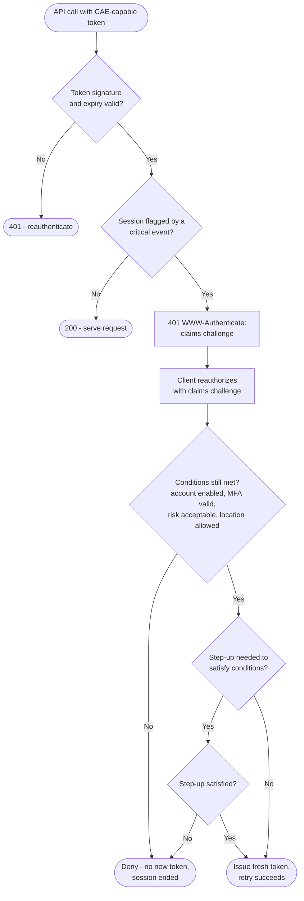

# Continuous Access Evaluation — Decision Flowchart

What happens on each API call once a CAE-capable token exists: honour it, or challenge and
re-evaluate against the current state of the world.

Notes

- The `FLAG` gate is the whole point: an unflagged session is served with a single token
  check and no IdP round trip, so CAE is cheap on the common path.
- Re-evaluation (`COND`) checks *current* state — a token issued before a password reset is
  refused even though its signature and expiry are still fine.
- Re-evaluation can conclude that assurance must be *raised*, not just confirmed, so the
  path can fold into [step-up](../step-up-authentication/README.md) before issuing a token.
