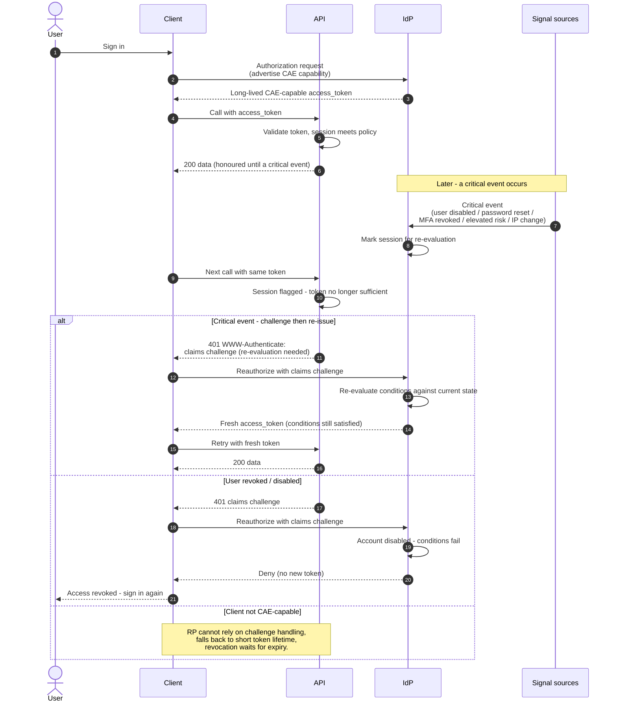

# Continuous Access Evaluation — Sequence Diagram

Happy path first (CAE-capable token issued, honoured while valid), then a critical event
that forces a claims challenge and re-evaluation, and the revoked-user deny branch.

Notes

- The token is honoured with **no extra round trips** until a critical event fires — CAE adds
  latency only when something actually changed.
- The `claims` challenge is what pulls the client back to the IdP, a client that merely
  retries the same token would loop, so CAE-capability is negotiated up front.
- Propagation from `Sig` to the IdP is fast but not instantaneous — CAE narrows the
  revocation window to seconds, it does not make it zero.
