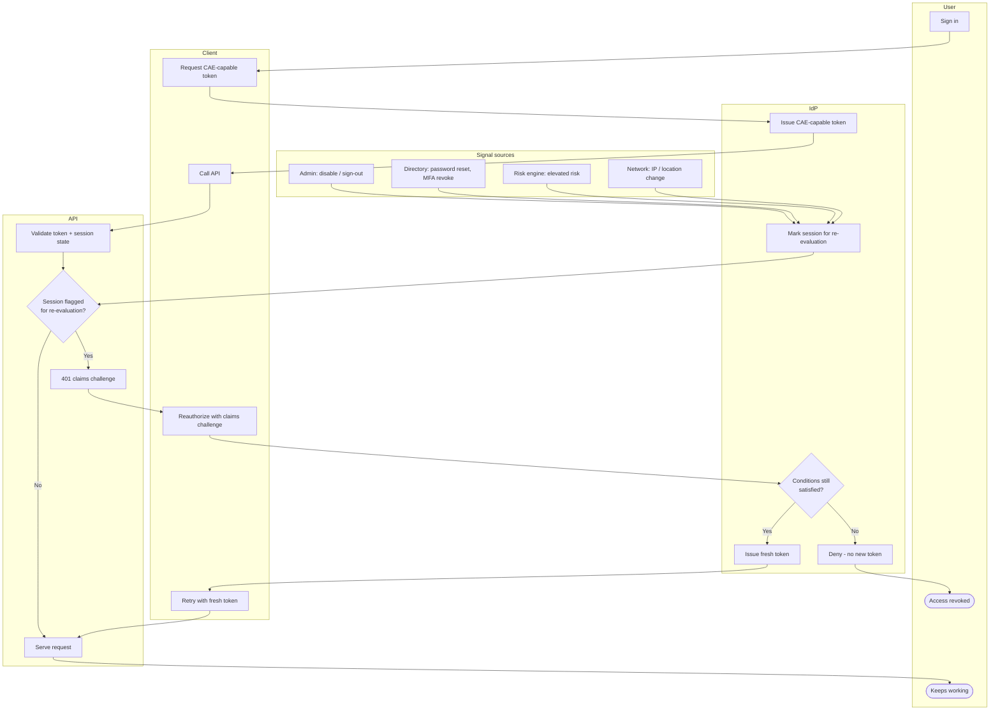

# Continuous Access Evaluation — Swimlane Diagram

One lane per actor. Signal sources publish the critical event; the API turns it into a
claims challenge; the IdP re-evaluates.

Notes

- The critical events in the Signal sources lane all funnel into the IdP's
  "mark for re-evaluation" step (`I2`); the API discovers the flag on the next call.
- The claims challenge (`A4 --> C3`) is the only cross-lane path back to the IdP mid-session —
  it is what makes revocation near-real-time.
- See [flowchart.md](flowchart.md) for the honour / challenge / re-issue / deny logic.
