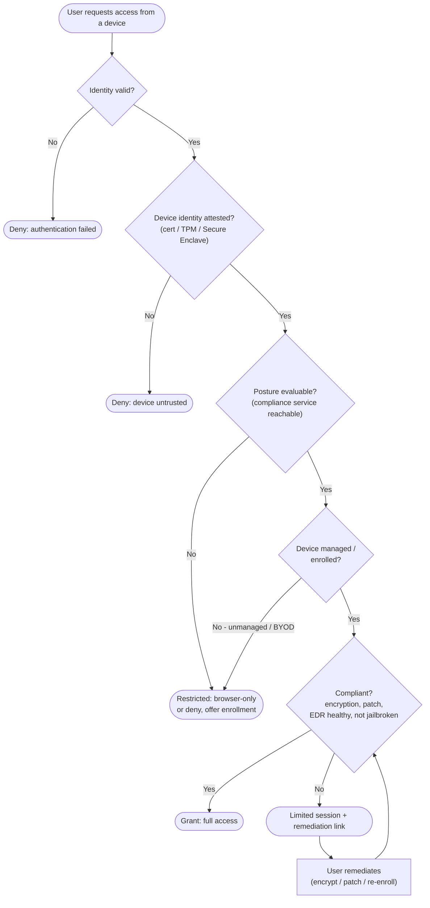

# Device Posture Conditional Access — Decision Flowchart

Identity plus device conditions mapped to grant / limited / block. The device gates sit
after identity but can override a valid user, and unevaluable posture fails closed.

Notes

- The gates are ordered identity → device identity → posture, a valid user on an
  unattested or non-compliant device never reaches `Grant`, which is the Zero Trust point.
- `Eval -->|No| Restricted` is the fail-closed rule: if posture cannot be evaluated the
  request is restricted, never granted on assumption of health.
- `Limited --> Remediate --> Comp` is the loop back into the compliance check, so fixing the
  device is the intended route from a `Limited` outcome to a full `Grant`.
