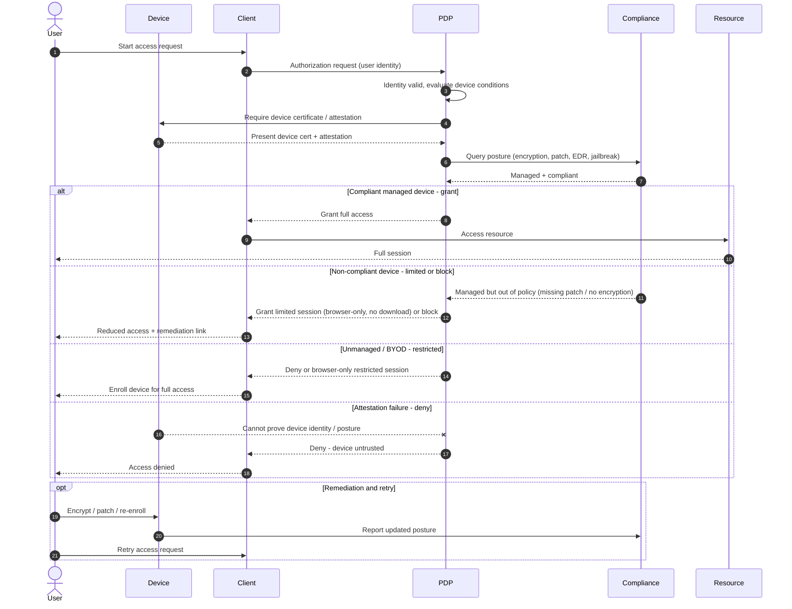

# Device Posture Conditional Access — Sequence Diagram

Happy path first (compliant managed device granted full access), then the non-compliant
limited/block, unmanaged, and attestation-failure alternates, plus the remediation loop.

Notes

- Identity is verified **before** device evaluation, but a valid user on a bad device still
  does not get full access, the device condition is a gate in its own right.
- Posture comes from the **Compliance** service against a hardware-backed attestation, not
  from the client's self-report, so the device cannot simply claim to be healthy.
- The limited-session branch keeps low-risk work possible on imperfect devices, which is why
  policy offers grant / limited / block rather than a single allow-or-deny.
