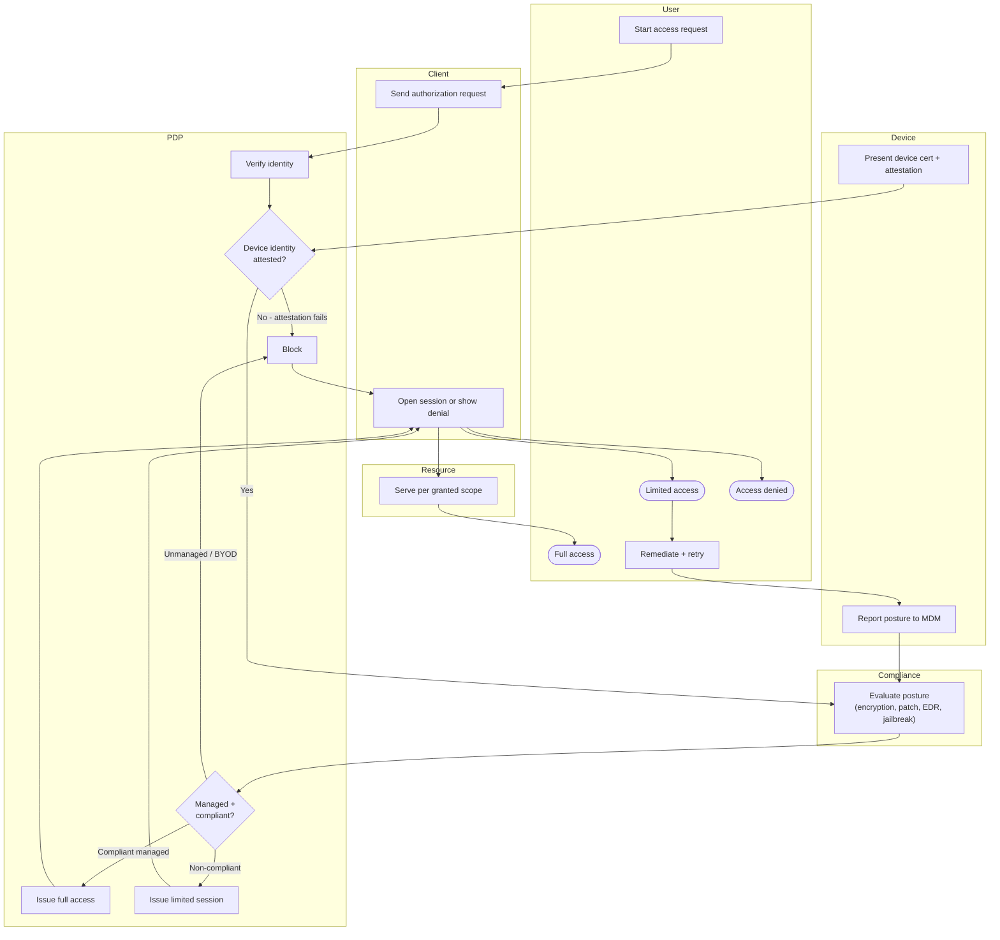

# Device Posture Conditional Access — Swimlane Diagram

One lane per actor. The PDP lane holds the decision; the Device and Compliance lanes supply
the attestation and posture the decision depends on.

Notes

- `P2` (attestation) and `P3` (posture) are the two device gates layered on top of identity
  `P1`, a failure at either downgrades or blocks regardless of who the user is.
- The Compliance lane (`M1`) is the source of truth for posture, the PDP never takes the
  device's own word, it acts on the MDM's evaluation of a hardware-backed claim.
- The remediation loop `U5 --> D2 --> M1` lets a fixed device re-enter evaluation without a
  new identity check, converting a `limited` outcome into `full` once compliant.
