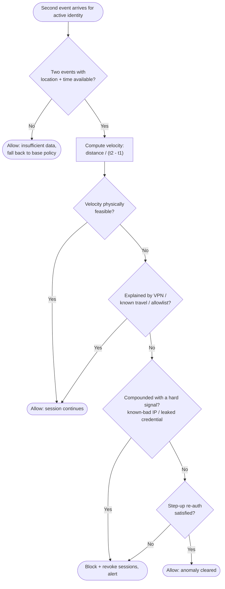

# Impossible Travel / Anomalous Session — Decision Flowchart

From a pair of authentication events to an outcome. Feasible travel passes; infeasible
travel is suppressed for VPN context, then routed to step-up or, when compounded, straight
to revoke.

Notes

- `Pair` guards against a single-event false alarm, velocity is undefined without two
  located events, so the flow falls back to base policy rather than inventing an anomaly.
- The `VPN` gate is the false-positive suppressor and runs before any enforcement, an
  infeasible-looking hop through a corporate egress is cleared to `Allow`.
- The two enforcement terminals diverge on confidence: `Hard` short-circuits to `Revoke`,
  while a bare anomaly gets a chance at `Stepup`, and a failed step-up also lands in
  `Revoke` — the flow fails closed.
