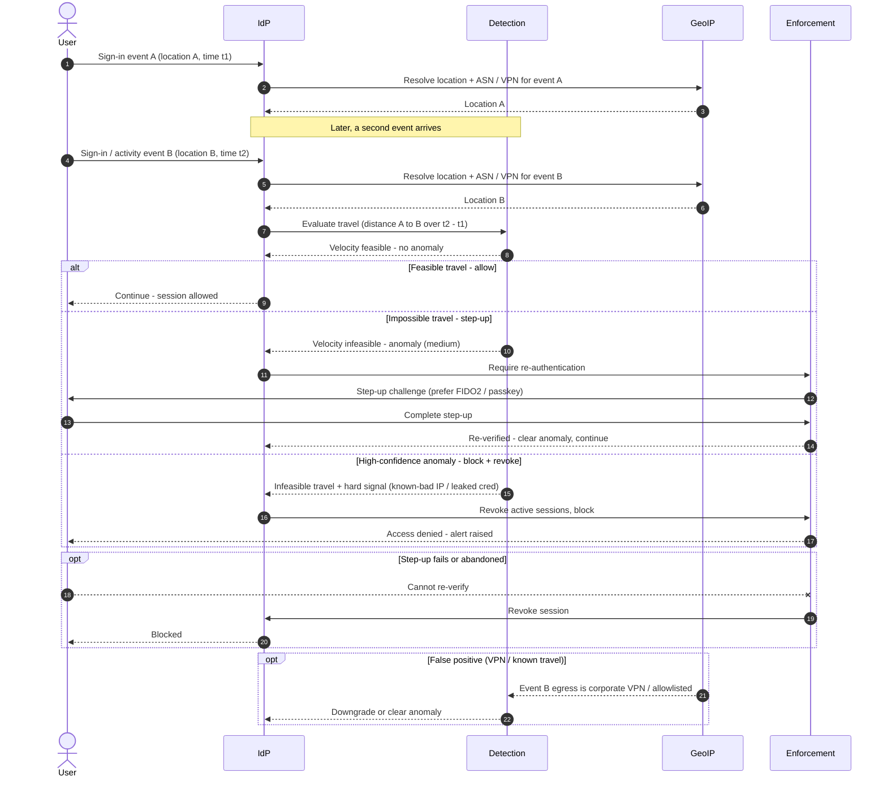

# Impossible Travel / Anomalous Session — Sequence Diagram

Happy path first (feasible travel, allowed), then the impossible-travel step-up, the
high-confidence block-and-revoke, the step-up-failure, and the VPN false-positive
alternates.

Notes

- The engine needs **two** events to compute velocity, the anomaly is a property of the pair
  (distance over elapsed time), not of either sign-in alone.
- A satisfied step-up **clears** the anomaly and continues, while a failure routes to revoke,
  the policy fails closed rather than leaving a suspicious session live.
- VPN and known-travel context (the last `opt`) is applied before blocking, so a corporate
  egress hop does not masquerade as an attacker on the other side of the world.
