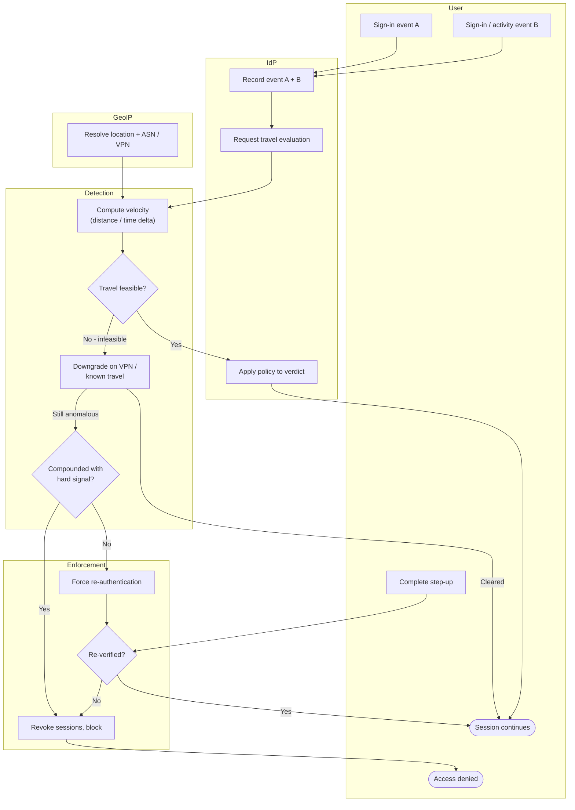

# Impossible Travel / Anomalous Session — Swimlane Diagram

One lane per actor. The Detection lane computes the velocity anomaly from GeoIP data; the
Enforcement lane turns a verdict into step-up or revocation.

Notes

- The verdict is produced in the Detection lane (`T2`) from GeoIP input, the IdP lane only
  enforces it, keeping detection and policy separable.
- `T4` (VPN / known-travel downgrade) sits before enforcement so a benign corporate egress
  is cleared rather than driven into step-up or revocation.
- `T3` splits medium from high confidence: a bare anomaly goes to step-up `E1`, while one
  compounded with a hard signal skips straight to `E3` revoke.
