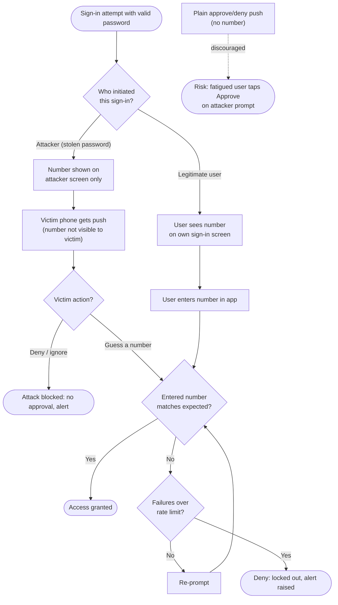

# MFA Fatigue and Number Matching — Decision Flowchart

The approval decision under number matching, showing why a push-bombing attacker cannot
approve and how repeated failures end in lockout.

Notes

- The root split `Init` is the whole defence: the number is bound to the **initiator**, so
  the attacker path (`AttNum --> VictimPush`) can never surface a number the victim could
  correctly enter.
- A brute-force guess collapses into the same `Match`/`Limit` loop, the small number space is
  protected by rate-limiting and `Lock`, not by secrecy alone.
- The dashed `Legacy` branch shows the discouraged one-tap flow whose only gate is a human
  reflex, which is precisely the `Fatigue` failure number matching eliminates.
