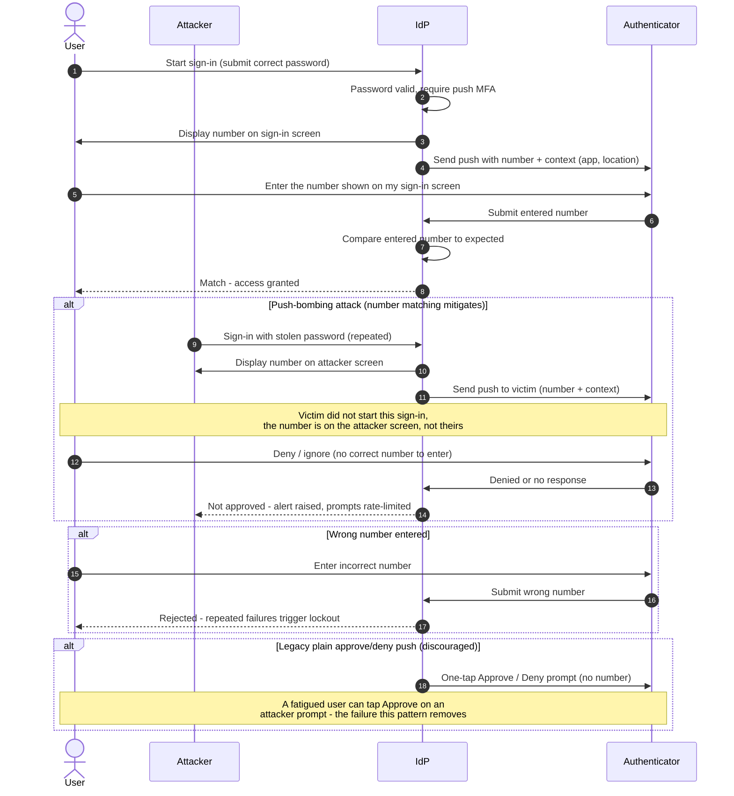

# MFA Fatigue and Number Matching — Sequence Diagram

Happy path first (legitimate sign-in with number matching), then the push-bombing attack
that number matching defeats, plus the wrong-number lockout and the discouraged plain
approve/deny alternates.

Notes

- The number is shown on the **initiating** device, so in an attack it is on the attacker's
  screen while the push lands on the victim's phone, the victim simply has no correct value
  to type.
- Entering a number is an **active** step, unlike a one-tap approve, which is why fatigue and
  reflex taps stop working once number matching is enforced.
- A burst of unrequested pushes means the password is already compromised, the `alert` and
  rate-limit in the attack branch are as important as the number itself.
