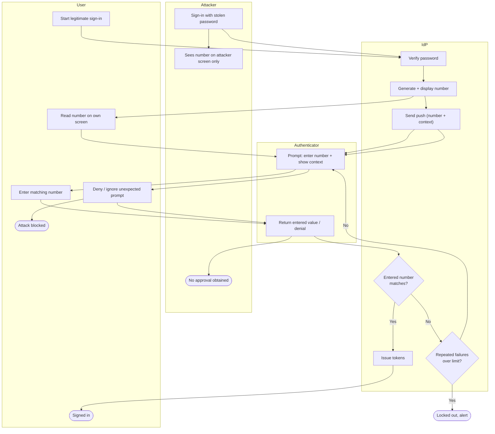

# MFA Fatigue and Number Matching — Swimlane Diagram

One lane per actor. The key asymmetry is visual: the number is generated in the IdP lane
and shown to whoever *started* the sign-in, while the prompt lands in the Authenticator
lane on the victim's phone.

Notes

- The number flows `I2 --> U2` to the legitimate initiator but `I2 --> A2` to the attacker,
  the victim in the Authenticator lane never receives it, so they cannot approve an attack.
- `I4` (match) and `I5` (rate-limit) are the two gates, a wrong or brute-forced number lands
  in `Lock` rather than granting.
- The attacker lane always terminates in `A3` with no approval because the approval path
  requires a value only the initiator can see.
