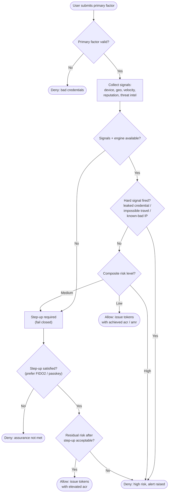

# Risk-Based Adaptive Authentication — Decision Flowchart

How signals become a risk level and how the level maps to allow / step-up / deny. Hard
signals are evaluated before soft ones so a known-bad context cannot be scored down to allow.

Notes

- The `AVAIL` gate encodes fail-closed behaviour: a missing engine or feed forces step-up,
  never a silent allow.
- Hard signals short-circuit to deny before the composite score is even consulted, because
  they represent confirmed-bad context rather than mere unfamiliarity.
- A satisfied step-up feeds back into a residual-risk check (`RE`); a high enough base risk
  can still deny even after a correct challenge.
