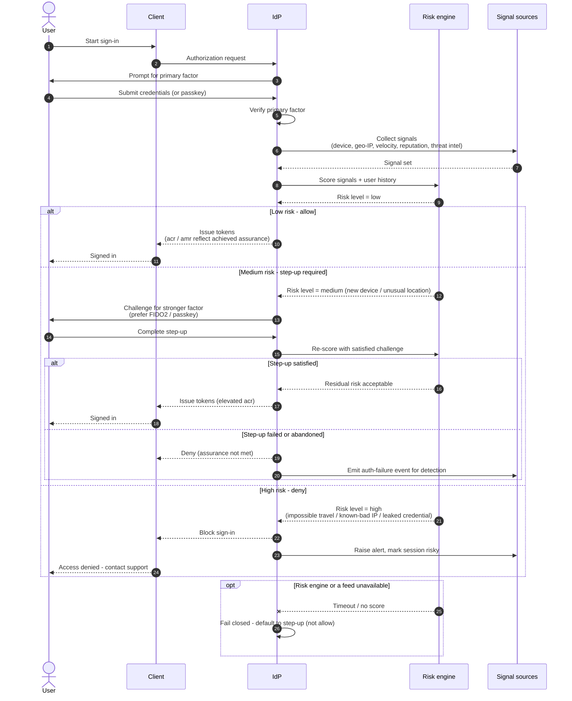

# Risk-Based Adaptive Authentication — Sequence Diagram

Happy path first (low risk, allowed), then the step-up and deny alternates, plus the
degraded-signal fallback.

Notes

- The primary factor is verified **before** scoring so the engine can bind the score to a
  known identity and its history, not an anonymous attempt.
- The achieved assurance is stamped into the token as `acr` / `amr` so downstream relying
  parties and [CAE](../continuous-access-evaluation/README.md) can reason about it.
- Hard signals (leaked-credential hit, impossible travel) short-circuit directly to deny;
  soft signals (new device) tend to route through step-up.
