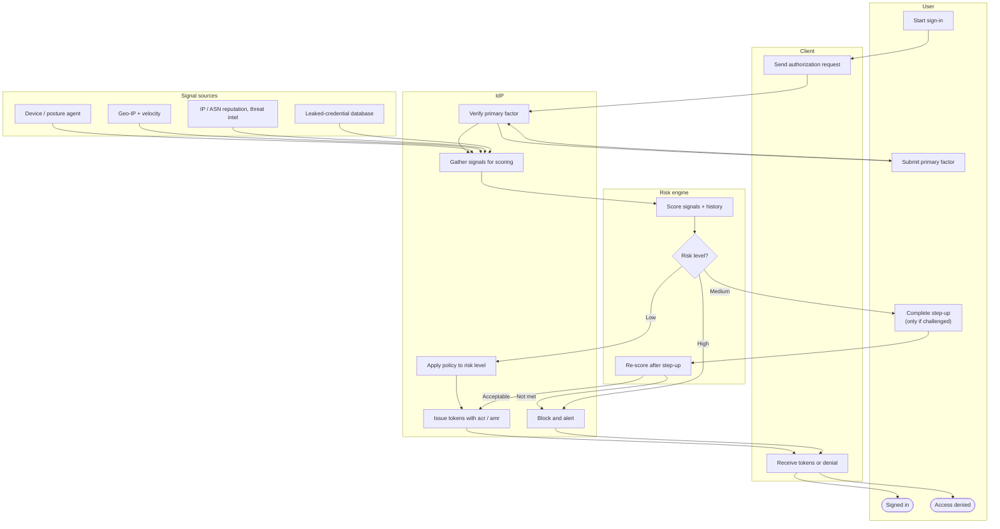

# Risk-Based Adaptive Authentication — Swimlane Diagram

One lane per actor. The decision lives in the Risk engine lane; the IdP lane enforces it.

Notes

- Signal sources feed the IdP's collection step (`I2`); the engine (`R1`) turns them into a
  single level the policy (`I3`) can act on.
- The medium branch loops back through the engine (`R3`) so a satisfied step-up actually
  lowers residual risk rather than blindly allowing.
- See [flowchart.md](flowchart.md) for the full ordering of hard-vs-soft signal precedence.
