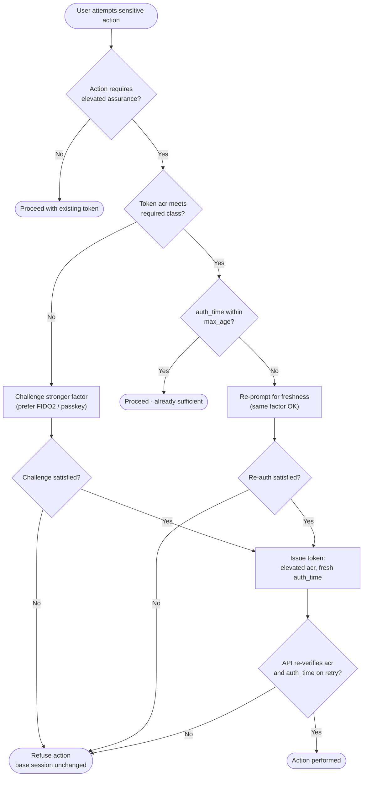

# Step-Up Authentication — Decision Flowchart

The assurance comparison a resource server and IdP jointly make: does the current session
meet the action's required class *and* freshness, and if not, can it be raised?

Notes

- Two independent conditions gate the action: the **class** (`acr`) and the **recency**
  (`auth_time` vs `max_age`). Failing either routes to a challenge, but only recency can be
  cured by re-running the *same* factor.
- The final `VER` gate makes the elevation authoritative on the server: the RP proves
  assurance from the reissued token's claims, closing the "we prompted, trust us" gap.
- A refused challenge is a dead end for the *action only* — it never downgrades or ends the
  base session.
