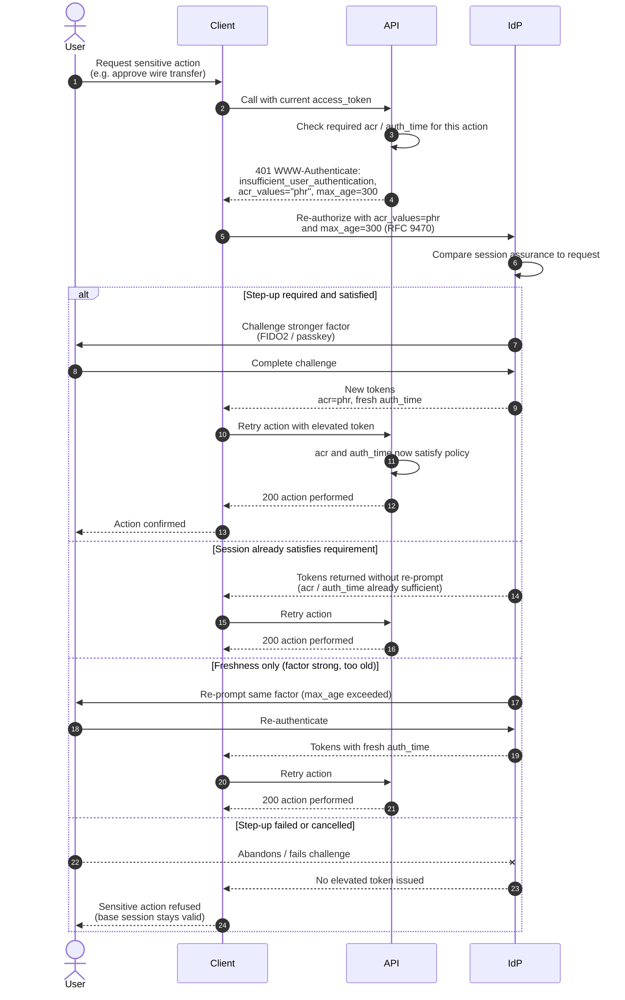

# Step-Up Authentication — Sequence Diagram

Happy path first (sensitive action triggers step-up, user satisfies it), then the
already-sufficient, freshness-only, and step-up-failed alternates. Uses the RFC 9470
`insufficient_user_authentication` challenge to trigger elevation.

Notes

- `acr_values="phr"` is illustrative shorthand for a phishing-resistant authentication
  context class; deployments use their own registered class URIs.
- The API re-checks `acr` and `auth_time` on the **retry** — the elevation is proven by the
  token's claims, never by the client asserting "we prompted".
- A failed step-up refuses only the sensitive action; the user's existing session and
  routine access are untouched.
