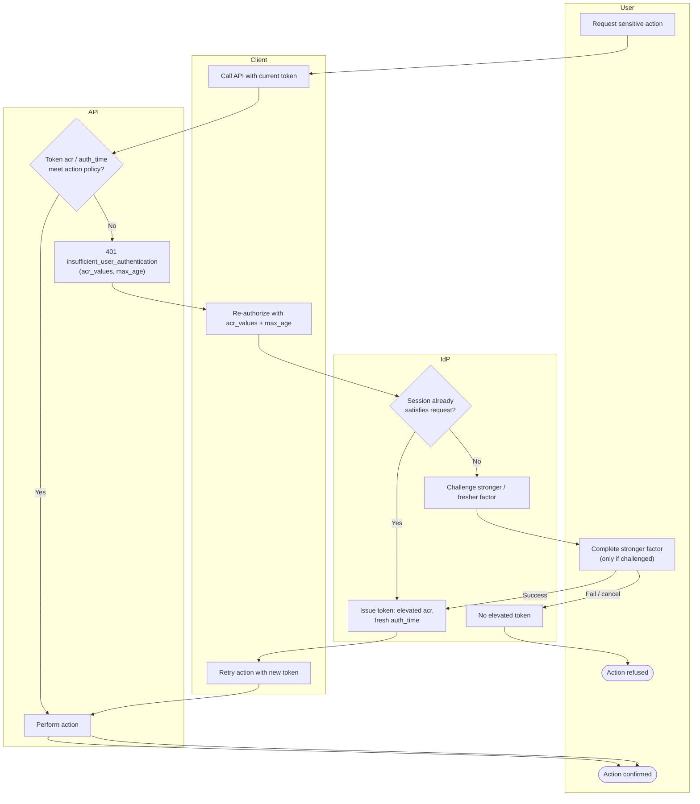

# Step-Up Authentication — Swimlane Diagram

One lane per actor. The API lane issues the challenge; the IdP lane raises assurance.

Notes

- The first pass through `A1` is the fast path: a token that already meets policy skips the
  IdP entirely.
- The challenge lives in the IdP lane (`I2`); the API only *demands* an assurance and
  *verifies* it on retry — it never runs the factor itself.
- See [flowchart.md](flowchart.md) for the exact `acr` / `max_age` comparison logic.
