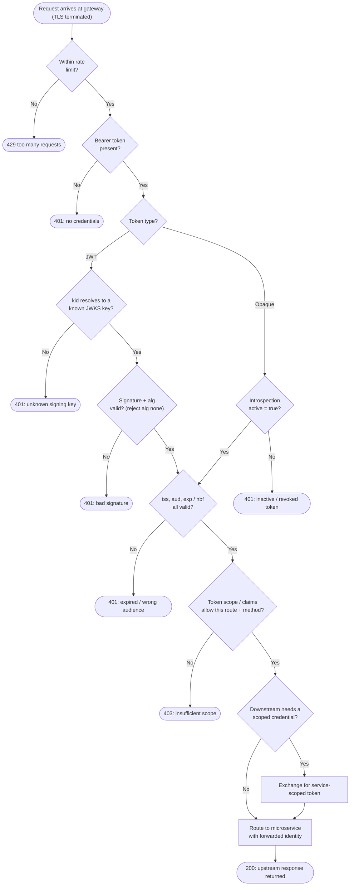

# API Gateway AuthN/AuthZ — Token Validation Decision Flowchart

The gateway's decision path for one request: rate limit, then token validation (JWT or
opaque), then scope-based authorization, then downstream token exchange and routing.
Each failure has an explicit deny terminal and the gateway fails closed.

Notes

- The **algorithm allow-list** gate is essential: rejecting `alg: none` and confusing
  algorithm substitution (e.g. RS256 verified as HS256) closes classic JWT bypasses.
- **401 vs 403 are distinct outcomes**: 401 means the token failed authentication; 403
  means it authenticated but lacks the scope for this resource. Conflating them leaks
  information and masks misconfiguration.
- Both token types converge on the same **claims** and **scope** gates — validation method
  differs, but the authorization decision is uniform.
- Any gate that cannot be positively satisfied denies; the gateway never routes on doubt.
