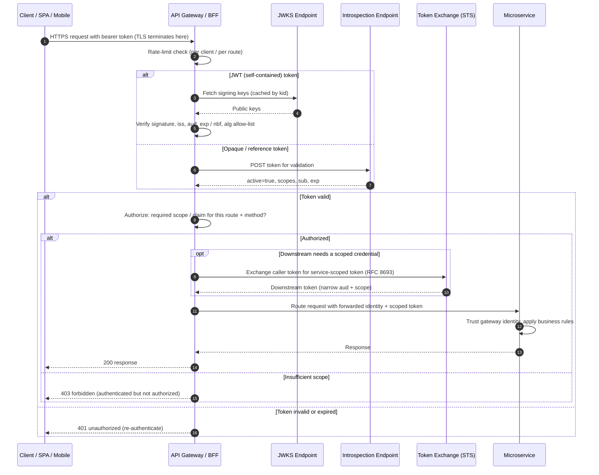

# API Gateway AuthN/AuthZ — Sequence Diagram

A request traversing the gateway: TLS termination, token validation (JWT or introspection),
scope-based authorization, rate limiting, token exchange for the downstream hop, and
routing to a microservice. `alt`/`opt` cover opaque-vs-JWT tokens and failure terminals.

Notes

- Rate limiting runs before any cryptographic work, step 2, so abusive callers are shed
  cheaply at the edge.
- Signature verification comes before any claim is trusted, step 7, keys are matched by
  kid from a cached JWKS and the algorithm is pinned to reject alg none.
- Authorization is a separate gate from authentication, a valid token that lacks the
  route's required scope still gets a 403, not a 200.
- Token exchange gives the microservice a narrowly scoped, audience-restricted credential
  instead of the caller's original token, containing blast radius per hop.
