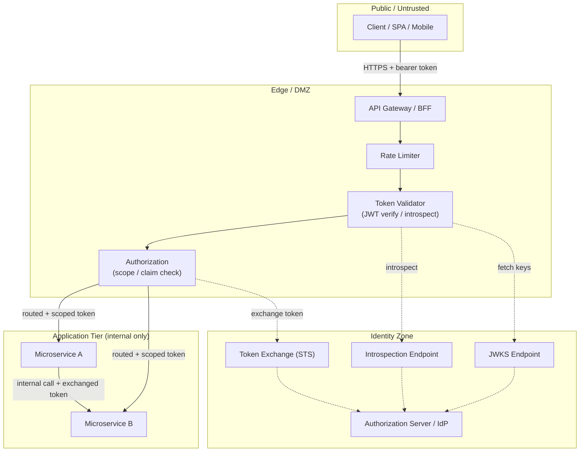

# API Gateway AuthN/AuthZ — Tier Topology Diagram

The gateway is the only component in the DMZ; microservices live in the application tier
and trust only forwarded gateway identity. The authorization server sits in its own
identity zone the gateway consults for keys and introspection.

Notes

- The **Public** zone reaches only the gateway; there is no route from a client to a
  microservice, JWKS, or introspection endpoint.
- Validation and authorization happen entirely within the **Edge** before any request is
  routed inward — the gateway is a [PEP](../zero-trust-architecture/README.md) for the app tier.
- Calls into the **Identity Zone** (dashed) are control-plane lookups: key fetch,
  introspection, and token exchange. They carry no application payload.
- Service-to-service calls (SvcA -> SvcB) use their own exchanged tokens, so a compromised
  service cannot replay the original caller's credential across the mesh.
