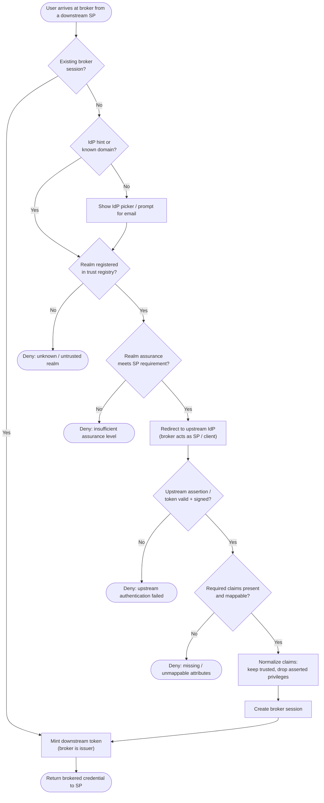

# Federation Topology — Home-Realm Discovery Decision Flowchart

How the broker decides which upstream IdP (if any) authenticates a given user, and how
it guards the claim-mapping boundary before issuing a downstream token. Deny terminals
are explicit.

Notes

- The **assurance gate** enforces that a low-assurance social login cannot satisfy an SP
  that demands enterprise-grade MFA, even if the user is genuinely authenticated upstream.
- **Sanitize** is where transitive trust is contained: privilege-bearing claims (group,
  role, entitlement) an upstream is not authoritative for are dropped rather than passed
  through to downstreams.
- Unknown realms fail closed at the registry check — the broker only ever redirects to a
  peer it holds signed metadata for.
- A live broker session skips the entire upstream round-trip, which is what delivers SSO
  across all downstream SPs.
