# Federation Topology — Sequence Diagram

A brokered login: the user starts at a downstream SP, the broker performs home-realm
discovery, delegates authentication to the correct upstream IdP, normalizes the returned
claims, and issues its own token to the SP. `alt` covers social vs enterprise upstreams
and an already-established broker session.

```mermaid
sequenceDiagram
    autonumber
    actor User
    participant SP as Downstream SP / RP
    participant Broker as Identity Broker (Hub)
    participant HRD as Home-Realm Discovery
    participant Ent as Upstream Enterprise IdP
    participant Soc as Upstream Social IdP
    participant Map as Claim Mapper

    User->>SP: Access protected application
    SP->>Broker: Redirect to broker (SP acts as RP of the hub)
    Broker->>Broker: Check for existing broker session

    alt Existing broker session (seamless)
        Broker->>Broker: Reuse session, skip upstream round-trip
    else No session - discover home realm
        Broker->>HRD: Determine user's home realm<br/>(email domain, IdP hint, or picker)
        alt Enterprise realm
            HRD-->>Broker: Route to enterprise IdP
            Broker->>Ent: AuthnRequest / authorize (broker acts as SP)
            Ent->>User: Authenticate (credentials + MFA)
            User->>Ent: Complete authentication
            Ent-->>Broker: Signed assertion / ID token
        else Social realm
            HRD-->>Broker: Route to social IdP
            Broker->>Soc: OIDC authorize (broker acts as client)
            Soc->>User: Consent + authenticate
            User->>Soc: Approve
            Soc-->>Broker: ID token + userinfo
        end
        Broker->>Map: Normalize upstream claims to canonical schema
        Map-->>Broker: Mapped identity (subject, email, groups)
        Broker->>Broker: Create broker session
    end

    Broker->>Broker: Mint downstream token / assertion<br/>(broker is the issuer the SP trusts)
    Broker-->>SP: Redirect back with brokered credential
    SP->>SP: Validate issuer = broker, consume claims
    SP-->>User: Signed in
```

Notes

- The broker is an SP/client on its upstream edges (steps 9, 15) and the issuer on its
  downstream edge (step 23) — two distinct trust relationships in one component.
- Home-realm discovery, step 6, only routes the request, it must not disclose whether an
  account exists at a given realm.
- The Claim Mapper is the trust boundary between upstream and downstream, only vetted
  attributes cross into the canonical identity, steps 19-20.
- A live broker session short-circuits the whole upstream round-trip, giving SSO across
  every downstream SP that trusts the hub.
