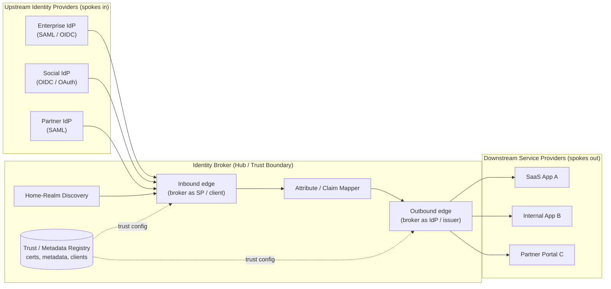

# Federation Topology — Hub-and-Spoke Zone Diagram

The broker sits at the center. Upstream IdPs feed identity in (broker acts as SP);
downstream SPs consume brokered tokens out (broker acts as IdP). One integration per
spoke instead of a full mesh.

Notes

- Every upstream trusts exactly one relying party (the broker's inbound edge) and every
  downstream trusts exactly one issuer (the broker's outbound edge): **N + M** integrations,
  not **N x M**.
- The **Trust / Metadata Registry** is the control-plane store that both edges read for
  peer certificates, endpoints, and client registrations — the single place key/metadata
  rotation happens.
- The **Claim Mapper** is the only path from the inbound to the outbound edge; nothing
  crosses without normalization, which is where transitive-trust risk is contained.
- Adding a spoke on either side is a single new registration in the hub — the strength and
  the risk of the hub-and-spoke model.
