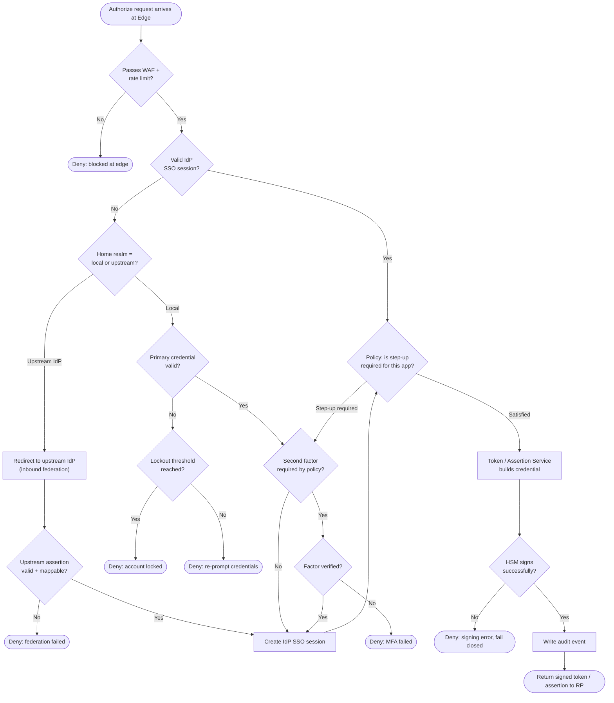

# IdP Reference Architecture — Authentication Decision Flowchart

The decision path a request follows inside the IdP, from edge admission through
credential and factor verification to token issuance. Every gate has an explicit deny
terminal.

Notes

- The edge admission gate runs before any credential is evaluated, so volumetric and
  bot traffic is shed before it can reach the authentication service.
- Seamless SSO still passes through the **policy** gate: an already-authenticated session
  can be forced into step-up MFA for a sensitive application.
- Signing failures **fail closed** — if the HSM cannot sign, no token is emitted rather
  than falling back to an unsigned or weakly signed credential.
- The upstream-federation branch mirrors the local branch but replaces credential/factor
  checks with validation and mapping of the external assertion.
