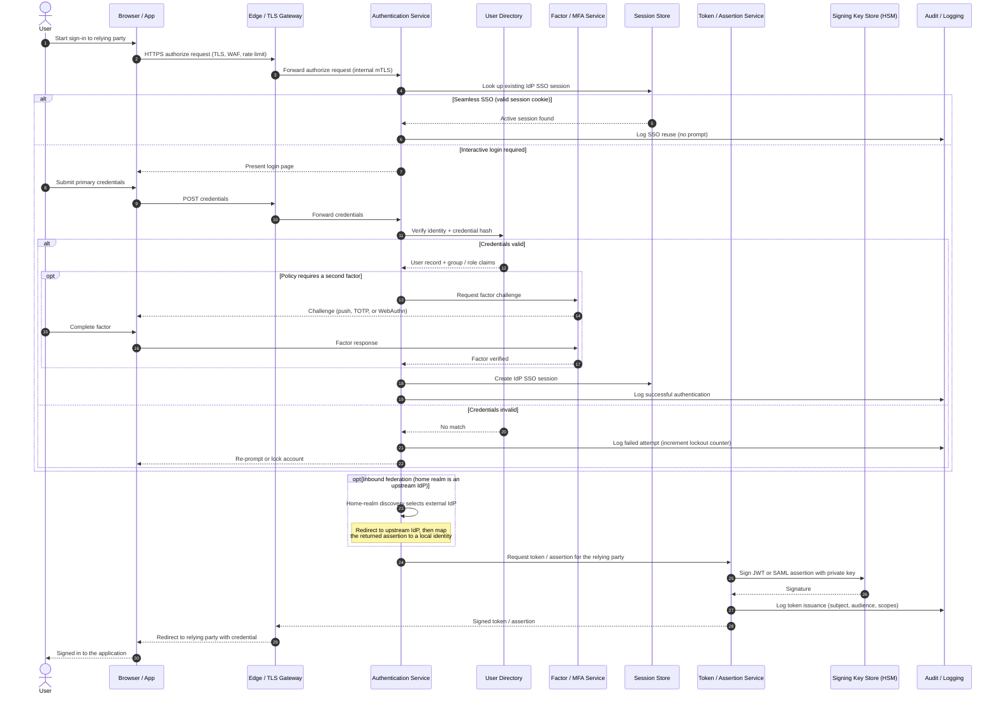

# IdP Reference Architecture — Sequence Diagram

A representative runtime flow: an interactive login that traverses the IdP's internal
components — edge, authentication service, directory, factor service, session store,
token service, and audit. `alt`/`opt` blocks cover seamless SSO, MFA step-up, and
inbound federation to an upstream IdP.

Notes

- The Edge is the only internet-facing hop, steps 2-3, everything after it is on the
  internal network reached over mutually authenticated TLS.
- Signing keys never leave the HSM boundary, steps 20-21, the Token Service asks the HSM
  to sign and only receives the signature back.
- The Session Store powers seamless SSO and is the object revoked on single logout, it is
  distinct from the short-lived token the Token Service mints.
- Every branch writes to Audit so both success and failure are independently reviewable.
