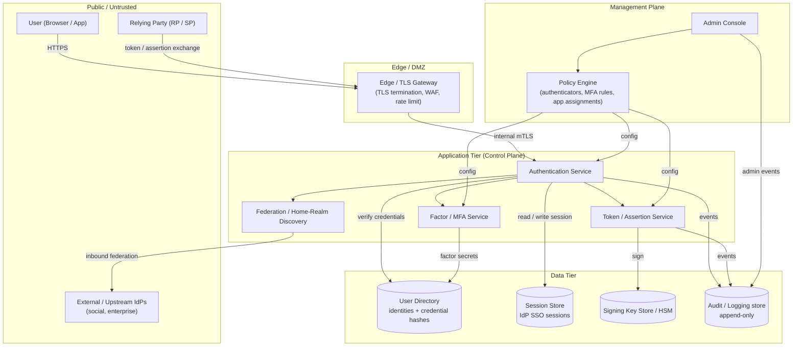

# IdP Reference Architecture — Component / Zone Topology

Components placed in their trust zone. Arrows show the only allowed flows across each
boundary: public traffic enters solely through the edge, application-tier services reach
data stores over an internal network, and the management plane is isolated.

Notes

- The **Public** zone can reach only the **Edge** — no direct path exists to any
  application-tier service or data store.
- The **Data Tier** holds every long-lived secret: credential hashes and factor secrets
  in the Directory, session state in the Session Store, and private keys in the HSM. Only
  named application-tier services may reach each store.
- The **Management Plane** pushes configuration down into the control plane and writes its
  own audit trail, but never sits in the request path of an end-user login.
- Inbound federation is the one sanctioned outbound path from the app tier to the public
  zone — it is drawn fully in the [Federation topology](../federation-topology/README.md) diagram.
