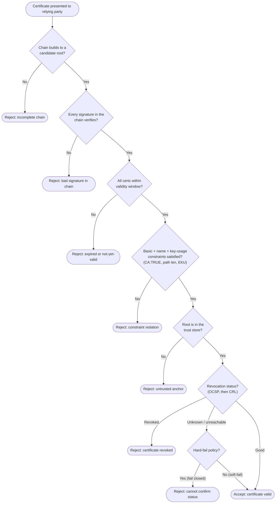

# PKI Hierarchy — Certificate Path Validation Flowchart

The relying party's decision path when validating a presented certificate: chain
building, per-certificate checks, trust-anchor confirmation, and revocation. Every failure
terminates in an explicit reject and validation fails closed.

Notes

- **Chain building and signature verification come first** — nothing downstream matters if
  the leaf does not cryptographically chain to a root.
- The **constraints** gate is where mis-issuance is caught: an end-entity cert must not
  assert `CA:TRUE`, and EKU/name constraints bound what each cert may be used for.
- **Trust-anchor confirmation is independent of chain math**: a technically valid chain to
  a root the RP does not trust is still rejected.
- The **revocation** gate distinguishes *revoked* from *status unknown*. Security-sensitive
  systems adopt **hard-fail** (reject when status cannot be confirmed); the soft-fail branch
  is shown for completeness but weakens the guarantee.
