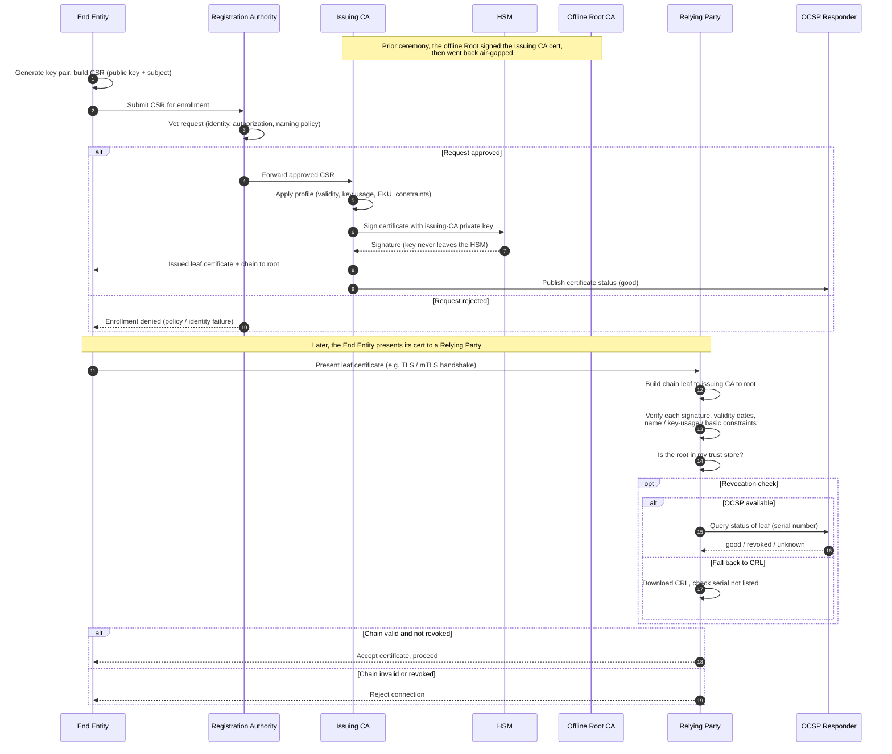

# PKI Hierarchy — Sequence Diagram

Two linked runtime flows: (1) an end entity enrolls and the issuing CA signs a leaf
certificate after RA vetting and HSM signing; (2) a relying party later validates that
certificate's chain to the offline root and checks revocation. `alt`/`opt` cover RA
rejection, OCSP vs CRL, and a revoked certificate.

Notes

- The offline root only appears in the setup note, at runtime it is air-gapped and never
  contacted, relying parties trust its cert from their local trust store.
- The RA is the policy gate before any signing, the CA applies a certificate profile that
  bounds validity, key usage, and constraints.
- Signing happens inside the HSM, steps 9-10, the issuing CA private key is non-exportable.
- Path validation and revocation are separate checks, a certificate can pass all the
  structural and date checks yet still be revoked, which is why the OCSP or CRL gate matters.
