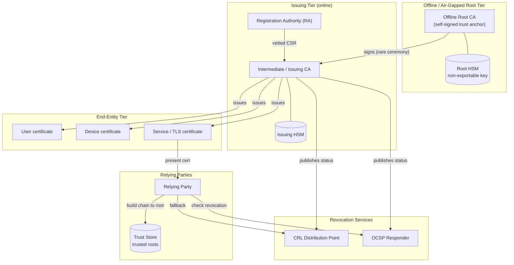

# PKI Hierarchy — Trust Tier Topology Diagram

The hierarchy top-down: the air-gapped root anchors trust, issuing CAs (with their RA and
HSM) sign leaf certs, end entities hold them, and revocation services plus relying-party
trust stores complete the ecosystem.

Notes

- The **Root Tier** is air-gapped: the root signs intermediates at infrequent ceremonies
  and is otherwise offline, so its key — the anchor of all trust — has minimal exposure.
- **Issuing CAs** are online and do all volume signing through their HSM; they are the
  revocable, replaceable layer that absorbs operational risk.
- End entities never chain directly to the root's key at runtime — relying parties trust
  the **root cert** from their local **Trust Store** and build the chain up from the leaf.
- **Revocation services** are published by the issuing CA and consulted by relying parties;
  they are what catch a compromised-but-unexpired certificate.
