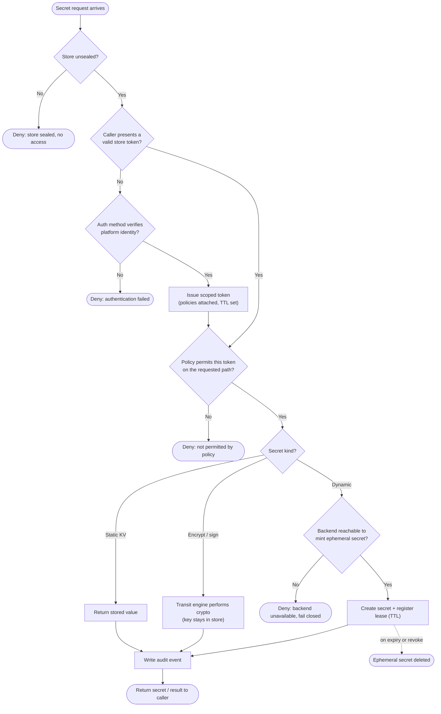

# Secrets Management — Access Decision Flowchart

The store's decision path for a secret request: seal state, caller authentication, policy
authorization, then dynamic issuance with a lease. Deny terminals are explicit and the
store fails closed when sealed.

Notes

- A **sealed** store is the ultimate fail-closed state: with the master key locked away,
  no request can read anything, even with a valid token.
- Authentication and authorization are separate gates — a valid token still must pass the
  **policy** check for the specific path it is requesting.
- Dynamic issuance registers a **lease**, so every secret has a TTL and an automatic
  revocation path; expiry deletes the ephemeral credential at the target system.
- Encryption-as-a-service returns a result without ever handing out key material, keeping
  keys inside the trust boundary.
