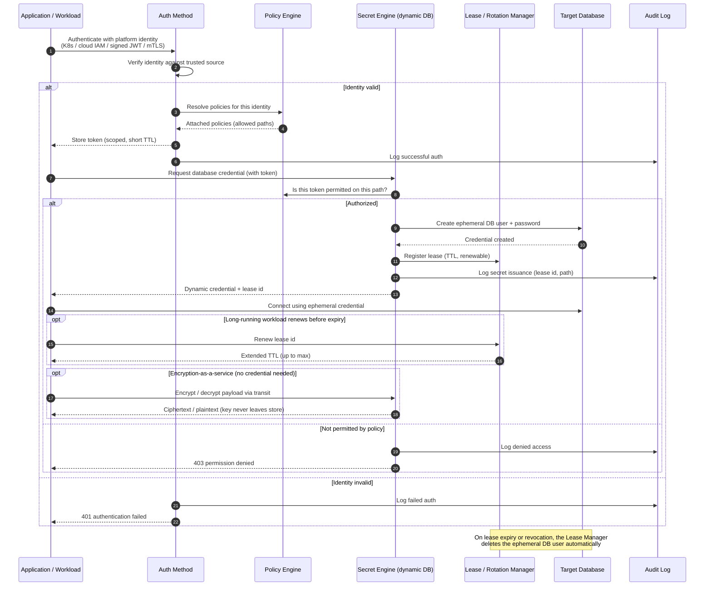

# Secrets Management — Sequence Diagram

A representative runtime flow: an application authenticates to the secret store with its
platform identity, receives a policy-scoped token, and fetches a **dynamic database
credential** with a short lease. `alt`/`opt` cover encryption-as-a-service, lease renewal,
and revocation.

Notes

- The app never holds a long-lived database password, it authenticates with its platform
  identity and receives a credential that lives only as long as its lease, steps 12-17.
- Authorization is a policy check on the token, step 10, authentication alone does not
  grant access to a secret path.
- Encryption-as-a-service lets the app protect data without ever seeing the key, the
  transit engine does the crypto inside the boundary.
- Expiry and revocation are enforced by the Lease Manager deleting the ephemeral DB user,
  so a leaked credential becomes useless quickly and automatically.
