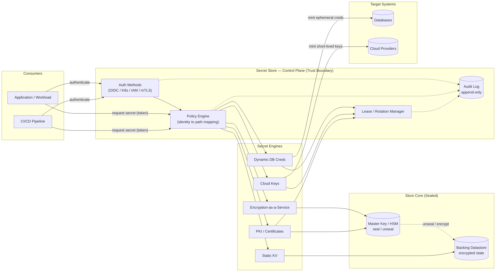

# Secrets Management — Zone Topology Diagram

Consumers on the left authenticate into the store's control plane, which drives the secret
engines and leans on the master key/HSM and encrypted storage. Target systems (databases,
clouds) sit in their own tier where dynamic secrets are minted.

Notes

- Consumers reach only the **control plane**; they never touch the backing datastore, the
  master key, or the target systems directly.
- The **Policy Engine** is the single chokepoint between an authenticated identity and any
  secret engine — least privilege is enforced here.
- The **Store Core** is sealed: the master key (HSM-protected) gates decryption of the
  backing datastore, so stolen storage alone yields nothing. Transit and PKI engines use
  the master key without ever exposing it.
- Dynamic engines mint credentials directly in the **Target Systems** and register a lease,
  so every issued secret has a bounded lifetime and a clean revocation path.
