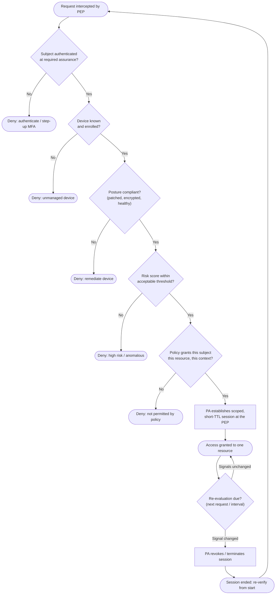

# Zero Trust Architecture — PDP Decision Flowchart

The Policy Engine's allow/deny logic for a single request, evaluating identity, device
posture, risk, and policy together. Network location is never a factor. Deny terminals
are explicit and the continuous-verification loop is drawn.

Notes

- **Every gate must pass on every evaluation** — identity, device, posture, risk, and
  policy. There is no gate for "source is on the corporate network," by design.
- Access is granted to **one resource for one short-lived session**; the loop re-runs the
  full decision rather than trusting the earlier grant.
- Any signal change — a posture failure, a new risk alert, a revoked credential — routes
  through **Revoke** and forces re-verification, which is continuous verification in action.
- The decision **fails closed**: any gate that cannot be positively satisfied denies.
