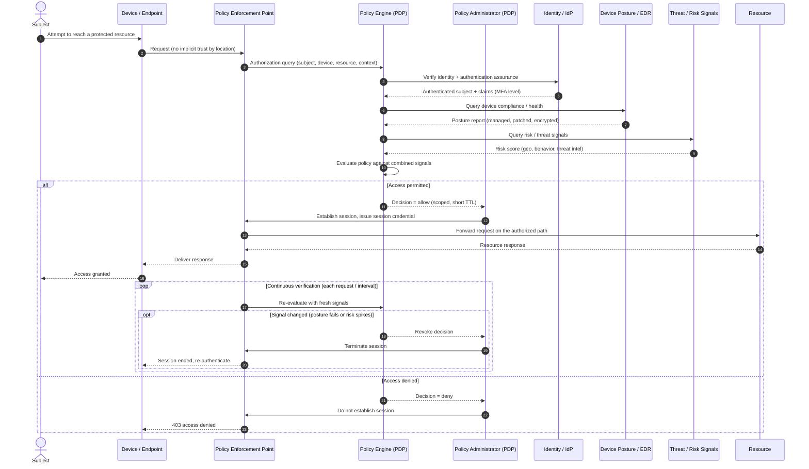

# Zero Trust Architecture — Sequence Diagram

A resource request evaluated by the PDP: the PEP intercepts, the Policy Engine gathers
identity/device/risk signals and decides, the Policy Administrator establishes a scoped
session, and the connection is continuously re-verified. `alt`/`opt` cover denial and
mid-session revocation.

Notes

- The PEP holds no policy of its own, steps 3 and every re-evaluation defer to the PDP, so
  the data plane cannot self-authorize.
- Identity, posture, and risk are gathered per decision, steps 4-9, a valid login alone is
  never sufficient.
- Continuous verification is the defining loop, a device that drops out of compliance is
  cut off on the next evaluation rather than at the next login.
- Access is granted to one resource for one short-lived session, there is no network
  segment handed over and no lateral movement implied.
