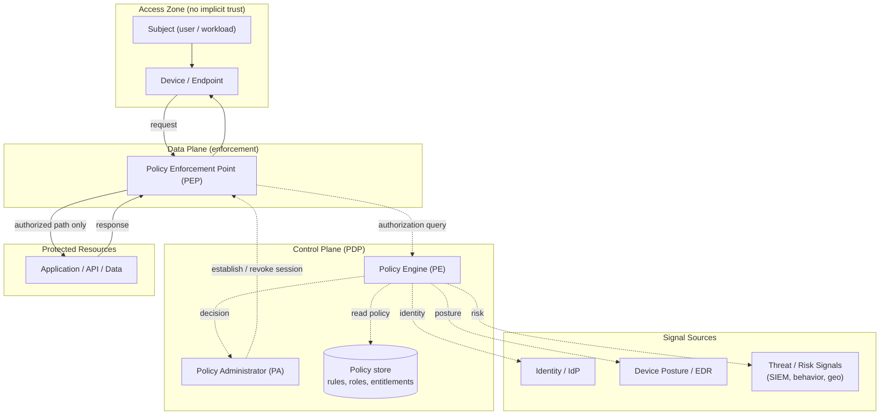

# Zero Trust Architecture — Control / Data Plane Zone Diagram

Components split into the untrusted access zone, the data-plane enforcement path, the
control-plane PDP, and the signal sources. The dashed lines are decision/signal flows;
solid lines are the data path. Note there is no trusted "internal network" zone.

Notes

- **No perimeter zone exists.** Every request from the Access Zone hits a PEP; there is no
  "inside" that is trusted by virtue of network position.
- **Control plane (dashed) never touches application data.** The PE decides and the PA
  establishes/revokes; only the PEP (data plane, solid) carries the request to the resource.
- **Every decision fans out to the signal sources.** Identity, device posture, and risk are
  independent inputs — combined per request, never cached into standing trust.
- The **Policy store** is the authoritative rule set the PE evaluates; changing policy there
  changes every subsequent decision without touching the enforcement path.
