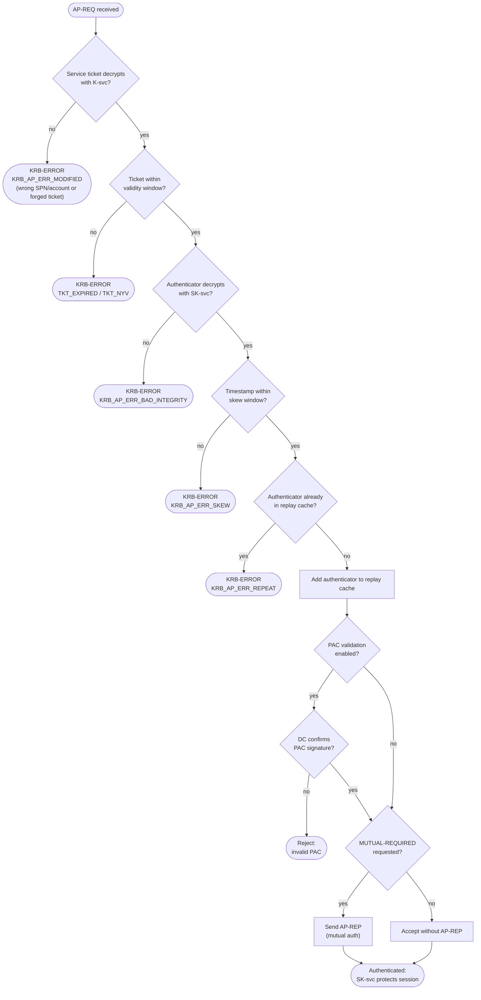

# AP Exchange — Decision Flowchart

Service-side decision logic for an AP-REQ, with explicit error terminals.

```mermaid
flowchart TD
    START(["AP-REQ received"]) --> V1{"Service ticket decrypts<br/>with K-svc?"}
    V1 -->|"no"| E1(["KRB-ERROR<br/>KRB_AP_ERR_MODIFIED<br/>(wrong SPN/account or forged ticket)"])
    V1 -->|"yes"| V2{"Ticket within<br/>validity window?"}
    V2 -->|"no"| E2(["KRB-ERROR<br/>TKT_EXPIRED / TKT_NYV"])
    V2 -->|"yes"| V3{"Authenticator decrypts<br/>with SK-svc?"}
    V3 -->|"no"| E3(["KRB-ERROR<br/>KRB_AP_ERR_BAD_INTEGRITY"])
    V3 -->|"yes"| V4{"Timestamp within<br/>skew window?"}
    V4 -->|"no"| E4(["KRB-ERROR<br/>KRB_AP_ERR_SKEW"])
    V4 -->|"yes"| V5{"Authenticator already<br/>in replay cache?"}
    V5 -->|"yes"| E5(["KRB-ERROR<br/>KRB_AP_ERR_REPEAT"])
    V5 -->|"no"| A1["Add authenticator to replay cache"]
    A1 --> V6{"PAC validation<br/>enabled?"}
    V6 -->|"yes"| V7{"DC confirms<br/>PAC signature?"}
    V7 -->|"no"| E6(["Reject:<br/>invalid PAC"])
    V7 -->|"yes"| V8
    V6 -->|"no"| V8{"MUTUAL-REQUIRED<br/>requested?"}
    V8 -->|"yes"| OK1["Send AP-REP<br/>(mutual auth)"]
    V8 -->|"no"| OK2["Accept without AP-REP"]
    OK1 --> DONE(["Authenticated:<br/>SK-svc protects session"])
    OK2 --> DONE
```
