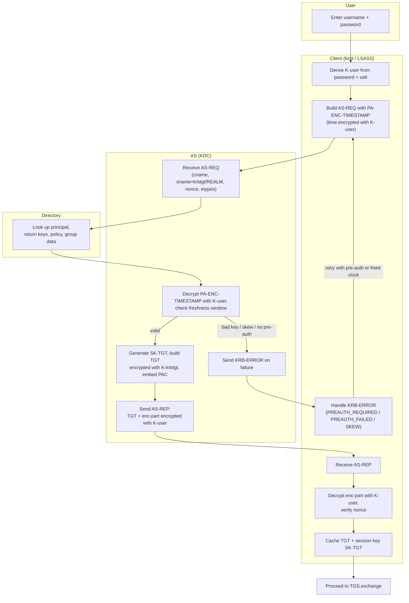

# AS Exchange — Swimlane Diagram

One lane per actor; arrows crossing lanes are protocol handoffs.

```mermaid
flowchart TD
    subgraph User
        U1["Enter username + password"]
    end

    subgraph Client["Client (kinit / LSASS)"]
        C1["Derive K-user from password + salt"]
        C2["Build AS-REQ with PA-ENC-TIMESTAMP<br/>(time encrypted with K-user)"]
        C3["Receive AS-REP"]
        C4["Decrypt enc-part with K-user,<br/>verify nonce"]
        C5["Cache TGT + session key SK-TGT"]
        C6["Handle KRB-ERROR<br/>(PREAUTH_REQUIRED / PREAUTH_FAILED / SKEW)"]
    end

    subgraph AS["AS (KDC)"]
        A1["Receive AS-REQ<br/>(cname, sname=krbtgt/REALM, nonce, etypes)"]
        A2["Decrypt PA-ENC-TIMESTAMP with K-user,<br/>check freshness window"]
        A3["Generate SK-TGT, build TGT<br/>encrypted with K-krbtgt, embed PAC"]
        A4["Send AS-REP:<br/>TGT + enc-part encrypted with K-user"]
        A5["Send KRB-ERROR on failure"]
    end

    subgraph Directory
        D1["Look up principal,<br/>return keys, policy, group data"]
    end

    U1 --> C1
    C1 --> C2
    C2 --> A1
    A1 --> D1
    D1 --> A2
    A2 -->|"valid"| A3
    A3 --> A4
    A4 --> C3
    C3 --> C4
    C4 --> C5
    A2 -->|"bad key / skew / no pre-auth"| A5
    A5 --> C6
    C6 -->|"retry with pre-auth or fixed clock"| C2
    C5 --> NEXT["Proceed to TGS exchange"]
```
