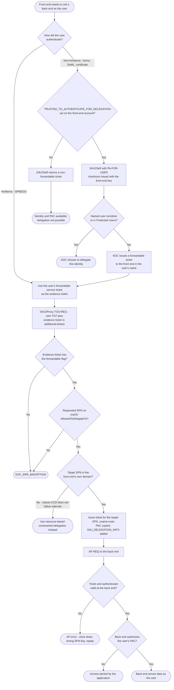

# Constrained Delegation — Decision Flowchart

Two KDC decisions decide everything: whether S4U2Self may return a **forwardable**
ticket, and whether the requested SPN is on the front end's allowlist.

Notes

- `Trans` is the protocol-transition switch. With it **off**, the only route to a
  usable evidence ticket is a genuine Kerberos logon by the user, which is why the
  *Use Kerberos only* mode is materially safer.
- `List` is per-SPN. Adding an SPN to the allowlist is a delegation-scope change
  and should be treated as a privileged operation; in AD it requires
  `SeEnableDelegationPrivilege`.
- `Sens` is where *Account is sensitive and cannot be delegated* and Protected
  Users membership protect tier-0 identities against a compromised front end.
- Everything downstream of `Issue` is a plain [AP Exchange](../ap-exchange/README.md);
  the back end applies its normal authorization and can still deny.
