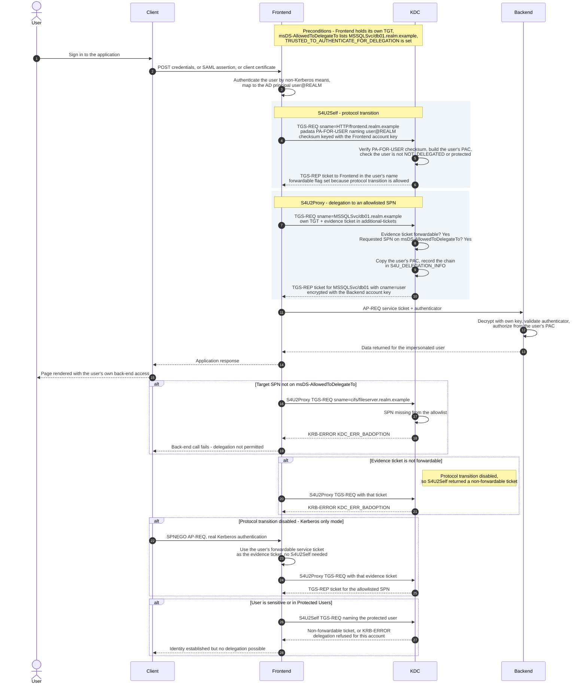

# Constrained Delegation — Sequence Diagram

Happy path: a front end authenticates the user by a non-Kerberos method, performs
**S4U2Self** to obtain a forwardable ticket in the user's name, then **S4U2Proxy**
to obtain a ticket for an allowlisted back-end SPN. Alternates cover a target SPN
that is not allowed, a non-forwardable evidence ticket, protocol transition
disabled, and a protected user.

Notes

- Both S4U calls are ordinary **TGS exchanges**; only the padata and the
  `additional-tickets` field distinguish them. See
  [TGS Exchange](../tgs-exchange/README.md).
- The `PA-FOR-USER` checksum is keyed with the front end's own long-term key, so
  only that account can request tickets naming other users — the trust boundary
  is the service account secret.
- The ticket that reaches the back end is indistinguishable from a normal user
  ticket apart from `S4U_DELEGATION_INFO` in the PAC; back-end authorization is
  unchanged.
- In *Kerberos only* mode the front end never uses S4U2Self for delegation — the
  user must have authenticated with Kerberos so a real forwardable service ticket
  exists to use as evidence.
