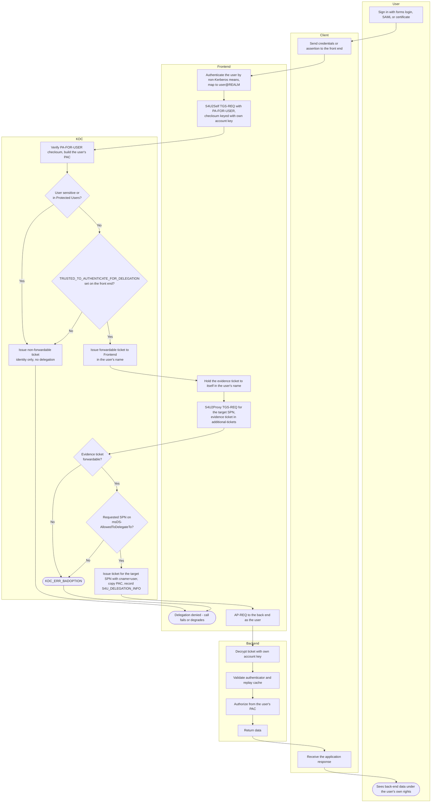

# Constrained Delegation — Swimlane Diagram

Lanes show who holds which secret: the front end owns the `PA-FOR-USER` checksum
key and the allowlist attribute, the KDC enforces both S4U checks, the back end
just consumes an ordinary user ticket.

Notes

- In *Kerberos only* mode the `F2 --> K1` path is skipped: the client's own
  SPNEGO AP-REQ supplies a forwardable service ticket that becomes the evidence
  ticket directly at `F4`. See [SPNEGO over HTTP](../spnego-http/README.md).
- `K7` is the constraint that names this model. Compare
  [RBCD](../resource-based-constrained-delegation/README.md), where the equivalent
  check reads an attribute on the **back end** instead.
- `K5` is a useful state in its own right: S4U2Self without protocol transition is
  a legitimate way to obtain a user's PAC for authorization decisions while
  deliberately forbidding onward delegation.
