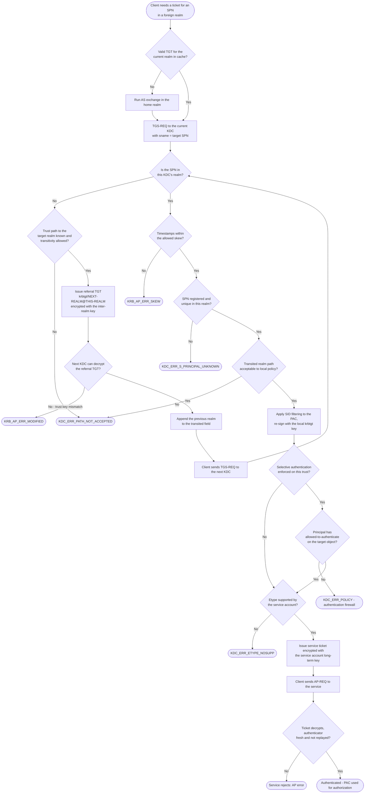

# Cross-Realm Authentication — Decision Flowchart

The referral loop: the client keeps exchanging TGTs until it reaches the KDC that
owns the target SPN, or until a KDC refuses. Every deny path terminates explicitly.

Notes

- The loop `Local --> Path --> Referral --> Hop --> Local` is the referral chain.
  Each iteration is one realm hop; clients enforce a maximum hop count to avoid
  chasing a misconfigured trust graph forever.
- `KDC_ERR_PATH_NOT_ACCEPTED` appears twice on purpose: it is returned both by the
  *referring* KDC when no path exists and by the *target* KDC when the path taken
  is not acceptable to its transit policy.
- SID filtering runs before the authorization decision, so filtered SIDs simply
  do not appear in the PAC the service later evaluates.
- The final AP-REQ leg is the ordinary [AP Exchange](../ap-exchange/README.md);
  nothing about it is cross-realm specific once the ticket is issued.
