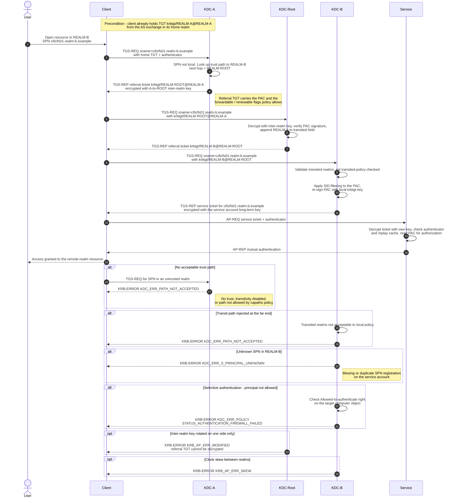

# Cross-Realm Authentication — Sequence Diagram

Happy path first: a client in `REALM-A` reaches a service in `REALM-B` through a
transitive trust with one intermediate hop at the forest root. Alternates follow:
no acceptable trust path, unknown SPN, selective authentication denial, and
trust-key / skew failures.

Notes

- Every hop is an ordinary TGS exchange; only the ticket that comes back differs —
  a referral TGT for the next realm instead of a service ticket. See
  [TGS Exchange](../tgs-exchange/README.md).
- The client, not the KDCs, drives the chain. There is no KDC-to-KDC traffic in
  Kerberos referrals.
- SID filtering happens on the **trusting** side. For a forest trust, SIDs from
  domains outside the trusted forest are stripped before the PAC is re-signed,
  which is the control that blocks SID-history escalation across the trust.
- With a two-hop path the client ends up caching three tickets: the home TGT, one
  referral TGT per intermediate realm, and the final service ticket.
