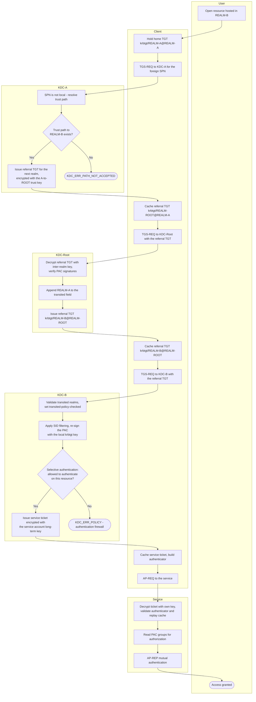

# Cross-Realm Authentication — Swimlane Diagram

One lane per actor. The client carries every message: each arrow that leaves the
Client lane is a separate TGS exchange against a different realm's KDC.

Notes

- The `KDC-Root` lane exists only because the trust is **transitive**. A direct
  two-way trust between `REALM-A` and `REALM-B` collapses that lane and leaves a
  single referral.
- Each referral TGT is encrypted with the **inter-realm trust key** of that hop,
  so only the next KDC in the chain can read it — the client treats it as opaque.
- SID filtering (lane `KDC-B`, step `B2`) is what keeps a compromised trusted
  realm from asserting privileged SIDs in the resource realm.
- Deny terminals are drawn in the lane of the KDC that makes the decision; the
  full decision tree is in [flowchart.md](./flowchart.md).
