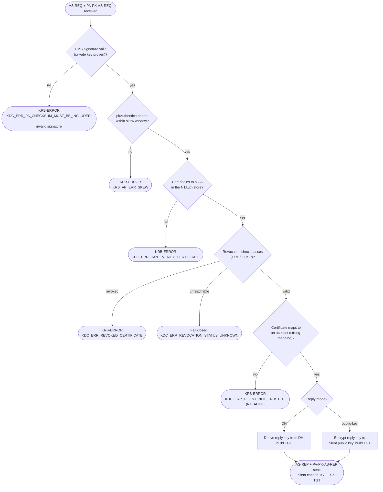

# PKINIT — Decision Flowchart

KDC-side decision logic for a PA-PK-AS-REQ, with explicit error terminals.

```mermaid
flowchart TD
    START(["AS-REQ + PA-PK-AS-REQ received"]) --> V1{"CMS signature valid<br/>(private key proven)?"}
    V1 -->|"no"| E1(["KRB-ERROR<br/>KDC_ERR_PA_CHECKSUM_MUST_BE_INCLUDED /<br/>invalid signature"])
    V1 -->|"yes"| V2{"pkAuthenticator time<br/>within skew window?"}
    V2 -->|"no"| E2(["KRB-ERROR<br/>KRB_AP_ERR_SKEW"])
    V2 -->|"yes"| V3{"Cert chains to a CA<br/>in the NTAuth store?"}
    V3 -->|"no"| E3(["KRB-ERROR<br/>KDC_ERR_CANT_VERIFY_CERTIFICATE"])
    V3 -->|"yes"| V4{"Revocation check passes<br/>(CRL / OCSP)?"}
    V4 -->|"revoked"| E4(["KRB-ERROR<br/>KDC_ERR_REVOKED_CERTIFICATE"])
    V4 -->|"unreachable"| E5(["Fail closed:<br/>KDC_ERR_REVOCATION_STATUS_UNKNOWN"])
    V4 -->|"valid"| V5{"Certificate maps to<br/>an account (strong mapping)?"}
    V5 -->|"no"| E6(["KRB-ERROR<br/>KDC_ERR_CLIENT_NOT_TRUSTED (NT_AUTH)"])
    V5 -->|"yes"| V6{"Reply mode?"}
    V6 -->|"DH"| OK1["Derive reply key from DH,<br/>build TGT"]
    V6 -->|"public-key"| OK2["Encrypt reply key to<br/>client public key, build TGT"]
    OK1 --> DONE(["AS-REP + PA-PK-AS-REP sent:<br/>client caches TGT + SK-TGT"])
    OK2 --> DONE
```
