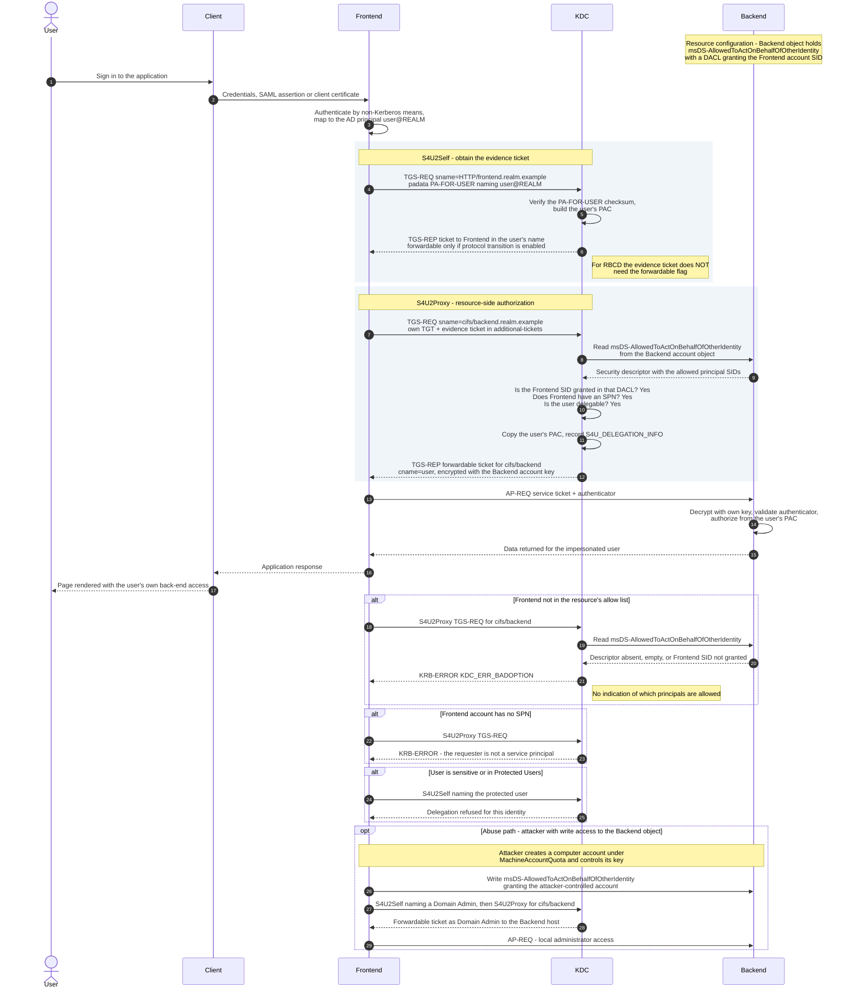

# Resource-Based Constrained Delegation — Sequence Diagram

Happy path: the front end performs S4U2Self, then S4U2Proxy for the back-end SPN,
and the KDC authorizes by reading the **back end's**
`msDS-AllowedToActOnBehalfOfOtherIdentity`. Alternates cover a front end absent
from the allow list, a front end without an SPN, a protected user, and the
abuse path.

Notes

- The only structural difference from
  [constrained delegation](../constrained-delegation/README.md) is which object the
  KDC reads at S4U2Proxy time. Everything on the wire is identical.
- The forwardable relaxation noted at step 8 matters: a front end with **no**
  delegation privileges of its own can still complete RBCD, so the attribute write
  in the `opt` block is sufficient on its own to take over the resource.
- The KDC lookup drawn as `KDC->>Backend` is a directory read of the account
  object, not network traffic to the running service.
- Cross-domain RBCD works because the check is made by the KDC of the *resource's*
  domain; see [Cross-Realm](../cross-realm/README.md).
