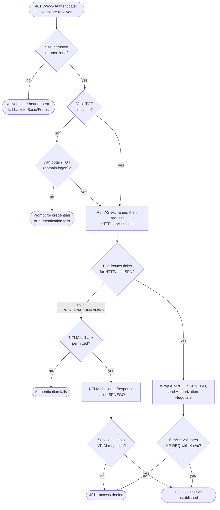

# SPNEGO over HTTP — Decision Flowchart

Browser-side decision logic for a Negotiate challenge, with explicit outcomes.

```mermaid
flowchart TD
    START(["401 WWW-Authenticate: Negotiate received"]) --> Q1{"Site in trusted<br/>intranet zone?"}
    Q1 -->|"no"| ALT1(["No Negotiate header sent -<br/>fall back to Basic/Forms"])
    Q1 -->|"yes"| Q2{"Valid TGT<br/>in cache?"}
    Q2 -->|"no"| Q3{"Can obtain TGT<br/>(domain logon)?"}
    Q3 -->|"no"| ERR1(["Prompt for credentials<br/>or authentication fails"])
    Q3 -->|"yes"| GET["Run AS exchange, then request<br/>HTTP service ticket"]
    Q2 -->|"yes"| GET

    GET --> Q4{"TGS issues ticket<br/>for HTTP/host SPN?"}
    Q4 -->|"no - S_PRINCIPAL_UNKNOWN"| Q5{"NTLM fallback<br/>permitted?"}
    Q5 -->|"no"| ERR2(["Authentication fails"])
    Q5 -->|"yes"| NTLM["NTLM challenge/response<br/>inside SPNEGO"]
    NTLM --> Q6{"Service accepts<br/>NTLM response?"}
    Q6 -->|"no"| ERR3(["401 - access denied"])
    Q6 -->|"yes"| OK(["200 OK - session established"])

    Q4 -->|"yes"| SEND["Wrap AP-REQ in SPNEGO,<br/>send Authorization: Negotiate"]
    SEND --> Q7{"Service validates<br/>AP-REQ with K-svc?"}
    Q7 -->|"no"| ERR3
    Q7 -->|"yes"| OK
```
