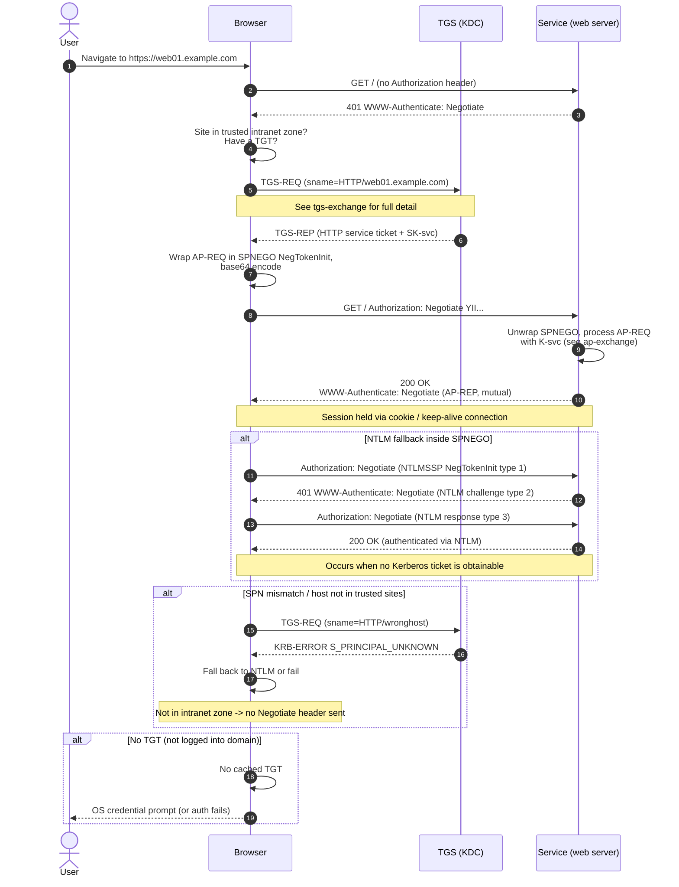

# SPNEGO over HTTP — Sequence Diagram

Happy path first (Kerberos Negotiate SSO), then NTLM fallback, SPN mismatch,
and no-TGT variants.

```mermaid
sequenceDiagram
    autonumber
    actor User
    participant Browser
    participant TGS as TGS (KDC)
    participant Svc as Service (web server)

    User->>Browser: Navigate to https://web01.example.com
    Browser->>Svc: GET / (no Authorization header)
    Svc-->>Browser: 401 WWW-Authenticate: Negotiate

    Browser->>Browser: Site in trusted intranet zone?<br/>Have a TGT?
    Browser->>TGS: TGS-REQ (sname=HTTP/web01.example.com)
    Note over Browser,TGS: See tgs-exchange for full detail
    TGS-->>Browser: TGS-REP (HTTP service ticket + SK-svc)

    Browser->>Browser: Wrap AP-REQ in SPNEGO NegTokenInit,<br/>base64 encode
    Browser->>Svc: GET / Authorization: Negotiate YII...
    Svc->>Svc: Unwrap SPNEGO, process AP-REQ<br/>with K-svc (see ap-exchange)
    Svc-->>Browser: 200 OK<br/>WWW-Authenticate: Negotiate (AP-REP, mutual)
    Note over Browser,Svc: Session held via cookie / keep-alive connection

    alt NTLM fallback inside SPNEGO
        Browser->>Svc: Authorization: Negotiate (NTLMSSP NegTokenInit type 1)
        Svc-->>Browser: 401 WWW-Authenticate: Negotiate (NTLM challenge type 2)
        Browser->>Svc: Authorization: Negotiate (NTLM response type 3)
        Svc-->>Browser: 200 OK (authenticated via NTLM)
        Note over Browser,Svc: Occurs when no Kerberos ticket is obtainable
    end

    alt SPN mismatch / host not in trusted sites
        Browser->>TGS: TGS-REQ (sname=HTTP/wronghost)
        TGS-->>Browser: KRB-ERROR S_PRINCIPAL_UNKNOWN
        Browser->>Browser: Fall back to NTLM or fail
        Note over Browser: Not in intranet zone -> no Negotiate header sent
    end

    alt No TGT (not logged into domain)
        Browser->>Browser: No cached TGT
        Browser-->>User: OS credential prompt (or auth fails)
    end
```
