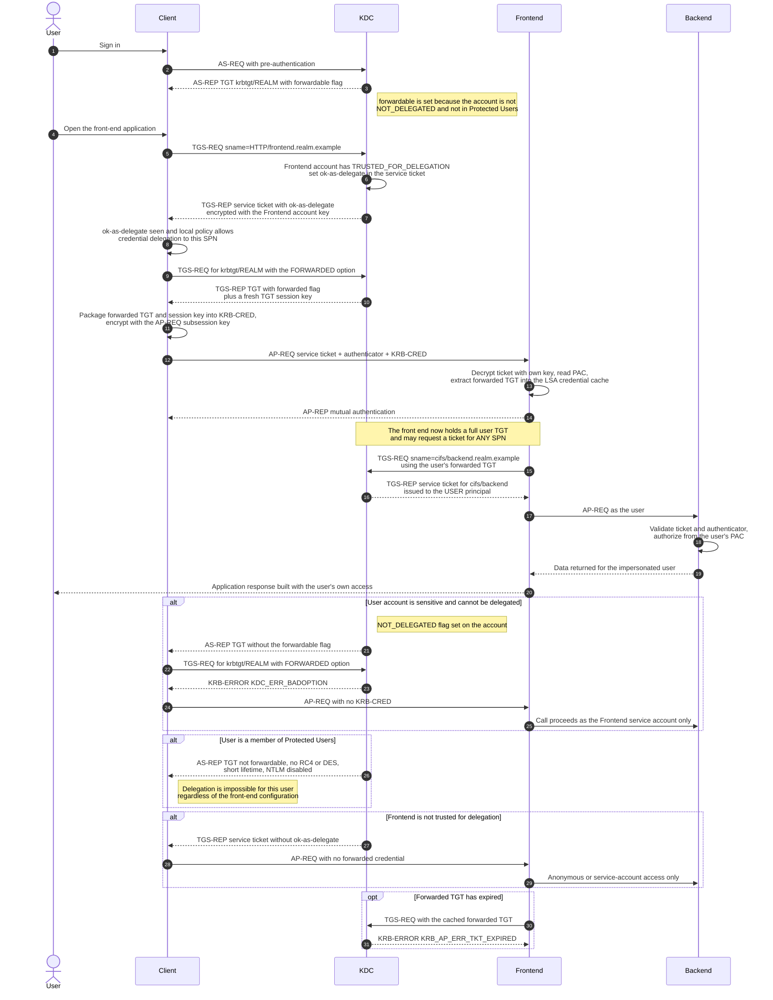

# Unconstrained Delegation — Sequence Diagram

Happy path: the user authenticates to a front-end service that is flagged
`TRUSTED_FOR_DELEGATION`, the client forwards a TGT, and the front end reuses it to
reach an arbitrary back end as the user. Alternates cover the sensitive-account
flag, Protected Users, a front end that is not trusted for delegation, and TGT
expiry.

Notes

- Steps 10–11 are the whole risk: after the AP-REQ the front end holds a **TGT**,
  not a scoped ticket. Nothing in the protocol limits which SPN it asks for next,
  and nothing marks the downstream request as delegated.
- The KRB-CRED is encrypted with the AP-REQ subsession key, so it is protected in
  transit — the exposure is at rest, in the front end's LSA cache.
- Coercion attacks abuse exactly this sequence with an attacker-controlled
  `Frontend`: force a domain controller's computer account to authenticate, then
  keep its forwarded TGT. See the security notes in [README.md](./README.md).
- The `ok-as-delegate` flag is advisory to the client; a hostile client can forward
  a TGT to a service that never asked for one, and a hostile service can simply
  keep whatever it receives.
