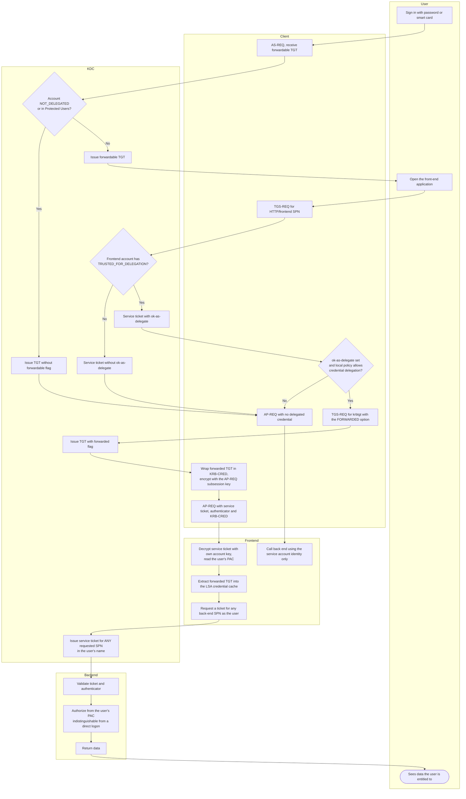

# Unconstrained Delegation — Swimlane Diagram

Lanes follow the credential: it starts in the KDC, passes through the client, and
ends up sitting in the front end's memory where it can be reused without limit.

Notes

- The `Frontend` lane keeps the credential after the request completes; the TGT
  outlives the transaction, which is what separates this model from
  [constrained delegation](../constrained-delegation/README.md).
- Two independent gates stop delegation: the KDC gate `K1` (account flags) and the
  client gate `C3` (`ok-as-delegate` plus local policy). Either one closing routes
  to `C7`, where the front end can only act as itself.
- `K8` accepts any SPN. There is no allowlist in this model — that is the entire
  difference from the S4U-based models.
